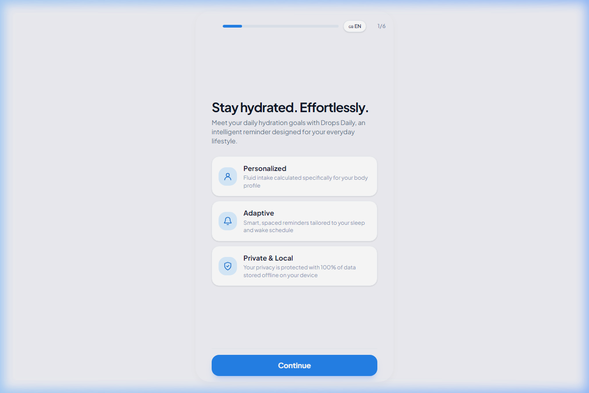
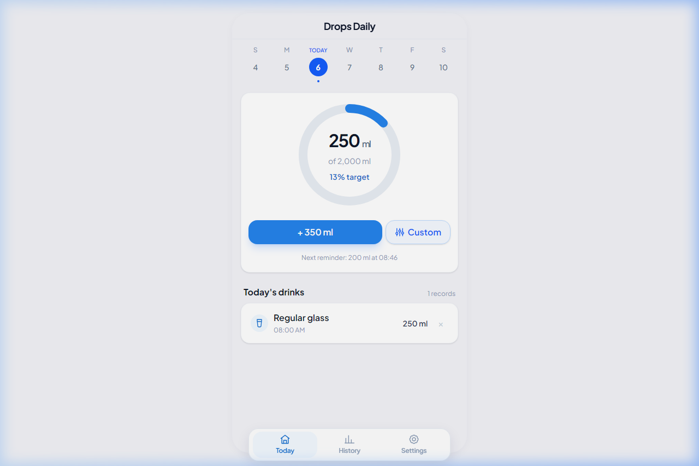
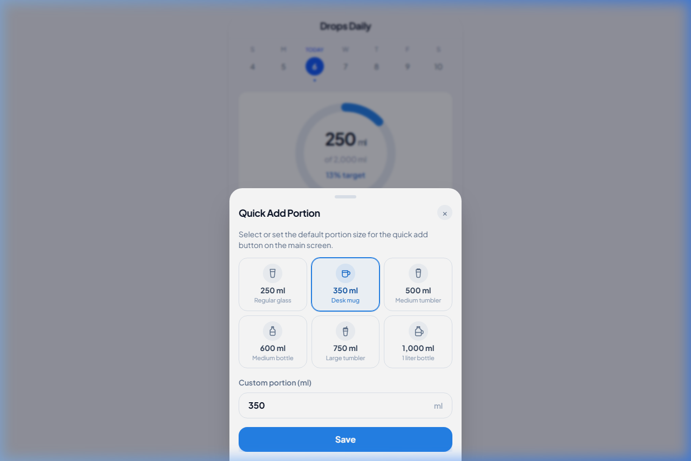
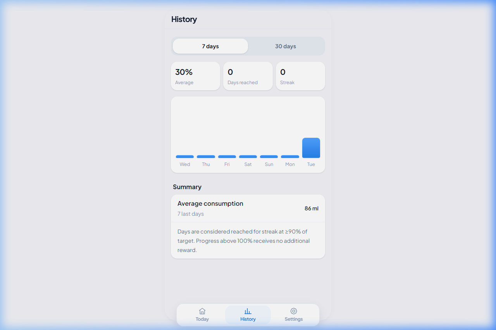
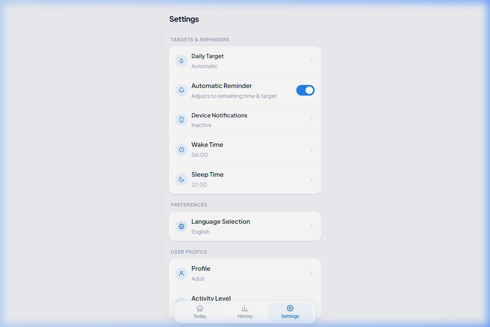

# 💧 Drops Daily — Aplikasi Pelacak & Pengingat Hidrasi Pintar

[](https://svelte.dev)
[](https://kit.svelte.dev)
[](https://www.typescriptlang.org)
[](https://tailwindcss.com)
[](https://web.dev/progressive-web-apps)
[](#lisensi)
[](#)

Progressive Web App (PWA) **local-first** modern untuk mencatat asupan air harian, menghitung kebutuhan cairan berbasis standar medis Kemenkes RI, serta memberikan pengingat adaptif dengan notifikasi push.

**[📱 Mulai Setup](#-panduan-setup) • [✨ Fitur](#-fitur-utama) • [🛠️ Tech Stack](#️-tech-stack) • [📸 Screenshots](#-screenshots)**

---

## 📋 Daftar Isi

- [📌 Tentang Proyek](#-tentang-proyek)
- [📸 Screenshots](#-screenshots)
- [✨ Fitur Utama](#-fitur-utama)
- [🛠️ Tech Stack](#️-tech-stack)
- [📁 Struktur Proyek](#-struktur-proyek)
- [🚀 Panduan Setup](#-panduan-setup)
- [🧪 Testing](#-testing)
- [🔐 Keamanan](#-keamanan)
- [📦 Deployment](#-deployment)
- [🤝 Kontribusi](#-kontribusi)
- [📄 Lisensi](#-lisensi)

---

## 📌 Tentang Proyek

**Drops Daily** adalah aplikasi web progresif yang dirancang khusus untuk membangun kebiasaan minum air sehat, konsisten, dan terukur. Berbeda dengan aplikasi pelacak air konvensional:

- 📊 **Perhitungan Personal**: Kebutuhan cairan berdasarkan usia, gender, berat badan, aktivitas fisik, dan kondisi medis (hamil, menyusui, dll) mengacu pada standar AKG Kemenkes RI 2019
- 🔒 **Privacy 100%**: Seluruh riwayat tersimpan di perangkat lokal (IndexedDB), tanpa cloud sync
- 📱 **Fully Offline**: Berfungsi sempurna tanpa koneksi internet, dapat diinstal di smartphone
- ⏰ **Smart Reminders**: Pengingat adaptif yang mengikuti jam bangun/tidur Anda
- 📈 **Analytics**: Visualisasi tren konsumsi dan statistik kebiasaan harian

---

## 📸 Screenshots

| 🚀 Onboarding | 💧 Dashboard | 🫗 Custom Portions |
| :---: | :---: | :---: |
|  |  |  |
| *Wizard personal berbasis AKG* | *Cincin progres & aksi cepat* | *Preset wadah khas Indonesia* |

| 📊 Histori & Analisis | ⚙️ Pengaturan & Backup |
| :---: | :---: |
|  |  |
| *Grafik tren & streak harian* | *Profil & ekspor JSON* |

---

## ✨ Fitur Utama

### 🧮 Kalkulator Hidrasi Berbasis Standar Medis
- Perhitungan ilmiah akurat menggunakan formula AKG 2019 Kemenkes RI
- Diferensiasi air murni vs cairan total (80% air putih)
- Dukungan kondisi khusus: ibu hamil, menyusui, pembatasan cairan medis

### 💧 Quick Add & Kustom Porsi Wadah Indonesia
- Aksi cepat: `+ 250ml`, `+ 500ml` dengan satu ketukan
- Porsi realistis: Gelas, Cangkir, Tumbler, Botol 1L
- Input numerik fleksibel dengan keyboard mobile otomatis

### 🔒 Arsitektur 100% Local-First
- Zero tracker, zero ads, zero cloud data exposure
- Penyimpanan lokal IndexedDB terenkripsi
- Ketahanan penyimpanan dengan API `navigator.storage.persist()`

### ⏰ Pengingat Adaptif & Web Push
- Jadwal pintar mengikuti ritme biologis (jam bangun/tidur)
- Mode tenang malam hari (*Quiet Hours*)
- Protokol W3C Web Push dengan VAPID

### 📊 Analisis Riwayat & Statistik
- Visualisasi tren 7 & 30 hari terakhir
- Rata-rata asupan, persentase keberhasilan, streak counter
- Audit log lengkap per hari

### 🎨 Pengalaman Pengguna Modern
- Header frosted glass sticky
- Floating bottom navigation bar
- Mikro-animasi responsif dan umpan balik haptic visual

### 💾 Backup & Restore Mandiri
- Ekspor JSON: `drops-daily-backup-YYYY-MM-DD.json`
- Impor & migrasi ke perangkat lain tanpa cloud

---

## 🛠️ Tech Stack

| Layer | Teknologi | Versi | Deskripsi |
| :--- | :--- | :--- | :--- |
| **Frontend Core** | [Svelte](https://svelte.dev) | ^5.0.0 | Library reaktif dengan Runes, ultra-ringan |
| **Meta Framework** | [SvelteKit](https://kit.svelte.dev) | ^2.0.0 | Routing filesystem, PWA optimal |
| **Language** | [TypeScript](https://www.typescriptlang.org) | ^5.0.0 | Type safety & bug prevention |
| **Styling** | [Tailwind CSS](https://tailwindcss.com) | ^4.0.0 | Oxide engine dengan skema HSL modern |
| **Build Tool** | [Vite](https://vitejs.dev) | ^8.0.0 | Lightning fast HMR & bundling |
| **Database Klien** | [IndexedDB](https://developer.mozilla.org/en-US/docs/Web/API/IndexedDB_API) | Standard | Penyimpanan terstruktur offline |
| **PWA & Offline** | Service Worker | Standard | Installable app & offline support |
| **Web Push** | [`web-push`](https://github.com/web-push-libs/web-push) | ^3.6.0 | Notifikasi push W3C & VAPID |
| **Backend Serverless** | [Netlify Functions](https://netlify.com) | Native | Penjadwalan notifikasi latar belakang |

---

## 📁 Struktur Proyek

```text
drops-daily/
├── src/
│   ├── lib/
│   │   ├── components/              # Komponen Svelte reusable
│   │   ├── stores/                  # Svelte stores (state management)
│   │   ├── utils/                   # Utility functions & calculations
│   │   ├── services/                # IndexedDB & API services
│   │   └── types/                   # TypeScript type definitions
│   ├── routes/
│   │   ├── +page.svelte             # Halaman utama (dashboard)
│   │   ├── +layout.svelte           # Layout wrapper
│   │   ├── onboarding/              # Wizard onboarding
│   │   ├── history/                 # Halaman riwayat & statistik
│   │   └── settings/                # Pengaturan profil & backup
│   ├── app.html                     # HTML wrapper
│   ├── app.css                      # Global styling
│   └── app.ts                       # App initialization
├── static/
│   ├── icons/                       # PWA icons & favicons
│   ├── manifest.json                # Web app manifest
│   └── sw.js                        # Service Worker
├── docs/
│   └── screenshots/                 # 📸 Tangkapan layar
├── netlify/
│   ├── functions/                   # Netlify serverless functions
│   └── blobs/                       # Netlify blob storage
├── svelte.config.js                 # Konfigurasi SvelteKit
├── tailwind.config.js               # Konfigurasi Tailwind
├── tsconfig.json                    # TypeScript config
├── vite.config.ts                   # Vite config
├── package.json
└── README.md
```

---

## 🚀 Panduan Setup

### 📋 Prasyarat

- **Node.js** >= 22.x ([Unduh](https://nodejs.org))
- **NPM** >= 10.x (biasanya sudah dengan Node.js)
- **Git** untuk version control

Periksa versi:
```bash
node -v
npm -v
```

---

### ⚡ Langkah Instalasi

#### 1️⃣ Clone Repository
```bash
git clone https://github.com/dhafinfuad/drops-daily.git
cd drops-daily
```

#### 2️⃣ Pasang Dependencies
```bash
npm install
```

#### 3️⃣ Jalankan Dev Server
```bash
npm run dev
```

Akses di: **`http://localhost:5173`**

*Tip: Tekan `F12` → DevTools → Mode responsive untuk lihat tampilan mobile.*

---

## 🧪 Testing

### Validasi Tipe & Sintaks
```bash
npm run check
```
*Hasil expected: `0 errors, 0 warnings`*

### Production Build
```bash
npm run build
npm run preview
```

### Skenario Manual
1. **AKG Formula**: Ubah berat badan di Pengaturan → cek pembaruan target otomatis
2. **Quick Add**: Klik `+ 250 ml` → verifikasi cincin persentase naik
3. **Offline Mode**: DevTools → Network → Offline → reload halaman
4. **Backup/Restore**: Export data → reset → import JSON

---

## 🔐 Keamanan

### Best Practices
- 🛡️ **Zero Server Data**: Tidak ada data medis di server eksternal
- 🔑 **VAPID Protection**: Private key hanya di Netlify Functions
- 🧼 **Input Sanitasi**: Validasi batas min/max volume minum
- 🔒 **Content Security Policy**: Mencegah injeksi skrip eksternal
- 📦 **Log Cleanup**: Antrean log dibersihkan setiap 72 jam

---

## 📦 Deployment

### 1️⃣ Generate VAPID Keys
```bash
npm run vapid
```

### 2️⃣ Setup Netlify Environment Variables
Buka **Site Settings > Environment Variables**:
- `VAPID_PUBLIC_KEY`
- `VAPID_PRIVATE_KEY`
- `VAPID_SUBJECT` (contoh: `mailto:admin@domain.com`)

### 3️⃣ Deploy
```bash
# Via Netlify CLI
npx netlify deploy --prod

# Atau cukup push ke GitHub, Netlify auto-deploy
```

---

## 🤝 Kontribusi

Kami sangat menyambut kontribusi komunitas!

1. **Fork** repositori
2. **Buat branch** feature: `git checkout -b fitur/nama-fitur`
3. **Commit** perubahan: `git commit -m "feat: deskripsi fitur"`
4. **Push**: `git push origin fitur/nama-fitur`
5. **Buat Pull Request** dan jelaskan perubahan

Pastikan:
- ✅ `npm run check` lulus
- ✅ `npm run build` berhasil
- ✅ Commit messages deskriptif

---

## 📄 Lisensi

Proyek ini dilisensikan di bawah [MIT License](LICENSE). Bebas digunakan untuk keperluan komersial maupun non-komersial.

---

**Dibuat dengan ❤️ untuk kesehatan hidrasi Anda**
